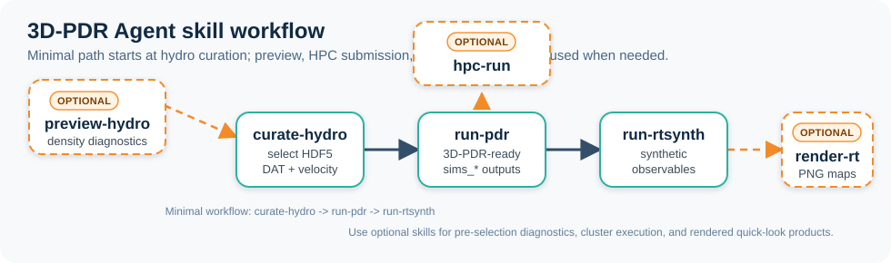

# 3D-PDR Agent 

## Motivation

This repository provides a modular, agent-compatible workflow for running 3D-PDR and RT-synth simulations, packaged as reusable skills.

Once you have installed 3D-PDR and RT-synth, you can use the skills in this repository to automate the entire workflow from raw hydro snapshots to synthetic observables. Your AI agent can call these skills and understand your requested parameters, fix the tedious compilation and setup steps, and execute the simulations for you.

## Features
- Canonical workflow skills in `plugins/3d-pdr-agent/skills/`
- Automated workflows for 3D-PDR and RT-synth
- Lightweight project metadata and helper scripts

## Directory Structure

- `INPUT/` — Simulation input data (formerly STARFORGE)
- `plugins/3d-pdr-agent/skills/` — canonical workflow skills
- `3D-PDR-dev/` — Link or clone to your local 3D-PDR runtime codebase
- `RT-synth/` — Link or clone to your local RT-synth codebase

## Prerequisites

1. An AI agent platform that can load local skills, such as Claude Code or Codex.
2. 3D-PDR and RT-synth codebases (see below)

### Option 1: Link to local 3D-PDR and RT-synth installations**

Place symlinks to your local 3D-PDR and RT-synth codebases in `./3D-PDR-dev` and `./RT-synth`.

### Option 2: Download codebases

- [3D-PDR](https://github.com/itamos-ism/3D-PDR) → `./3D-PDR-dev`
- [RT-synth](https://github.com/itamos-ism/RT-synth) → `./RT-synth`

## Install Skills

For a first version, keep the setup simple: install or link the skills directly from this repository.

Canonical skill folder:

`plugins/3d-pdr-agent/skills/`

Available skills:

- `preview-hydro`
- `curate-hydro`
- `run-pdr`
- `hpc-run`
- `run-rtsynth`
- `render-rt`

Recommended setup:

1. Clone this repository.
2. Make sure `./3D-PDR-dev` and `./RT-synth` are available in the workspace.
3. Point your agent to `plugins/3d-pdr-agent/skills/`, or copy/symlink the skill folders from there into the agent's local skill directory.

**For Claude Code or Codex, the simplest instruction is:**

> Install the skills from `plugins/3d-pdr-agent/skills/` and ensure the agent has access to `./3D-PDR-dev`, `./RT-synth`, and `./INPUT`.

## Skill Workflow

The hydro workflow can begin with an optional preview step:

`preview-hydro -> curate-hydro -> run-pdr -> run-rtsynth -> render-rt`

If the user already knows the input HDF5 file under `INPUT/`, the minimal workflow starts at curation:

`curate-hydro -> run-pdr -> run-rtsynth`

- `preview-hydro` inspects raw hydro snapshots with diagnostics such as `scripts/starforge_raw_density_plots.py`.
- `curate-hydro` merges raw placement, SELECTED curation, density DAT conversion, and RTsynth velocity DAT generation.
- `run-pdr` creates the 3D-PDR-ready run folder and executes 3DPDR.
- `run-rtsynth` generates synthetic observables from completed 3D-PDR outputs.
- `render-rt` converts RTsynth products into PNG diagnostics.

## Contributing

Contributions are welcome. Update `plugins/3d-pdr-agent/skills/` as the canonical skill source.

---
For more details, see the documentation in each skill directory and the main workflow files.
